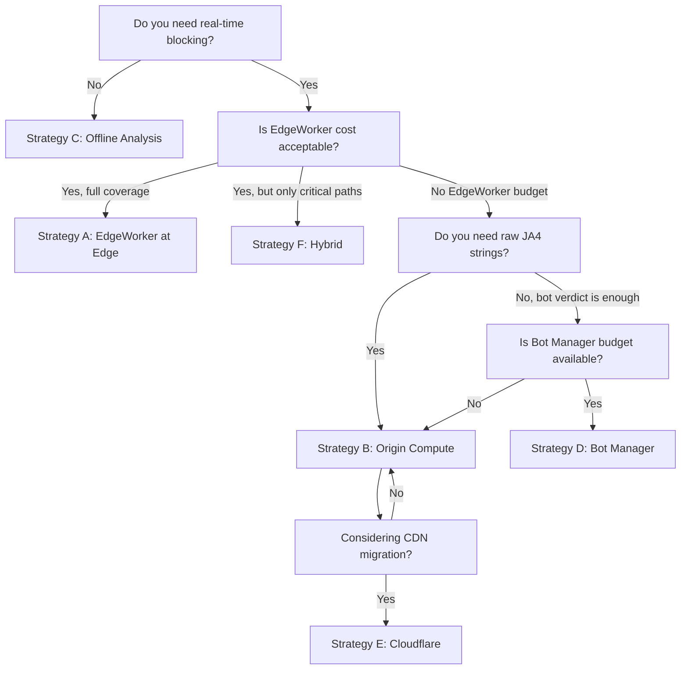
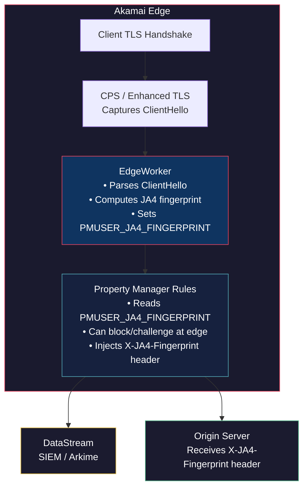
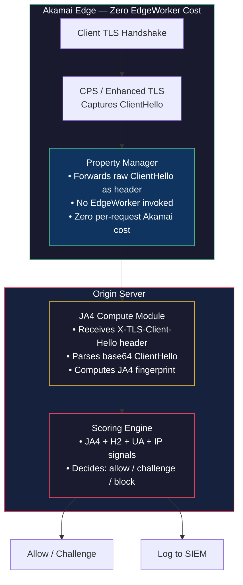
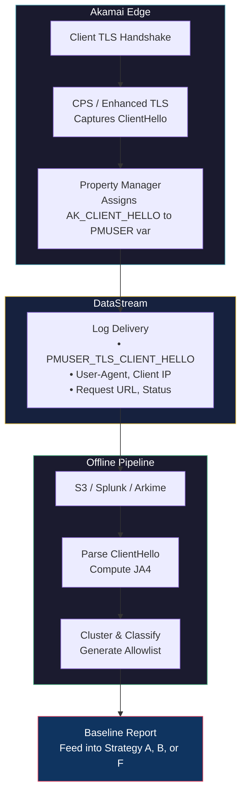
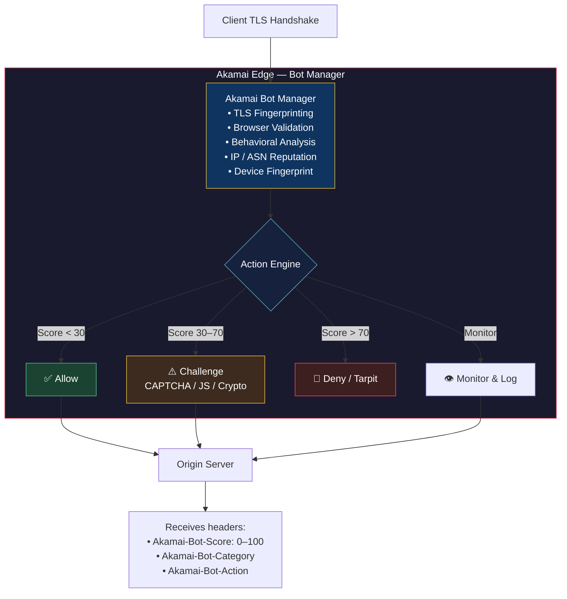
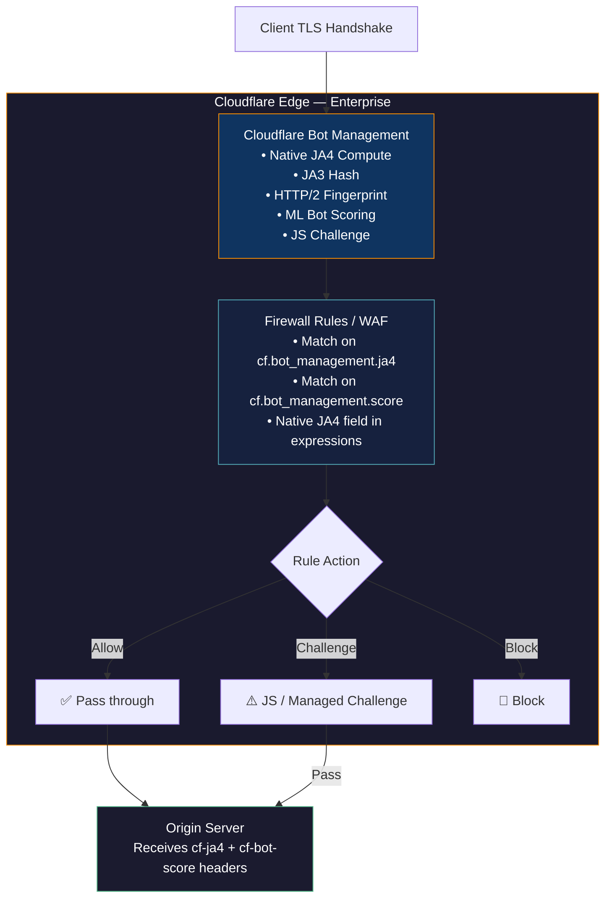
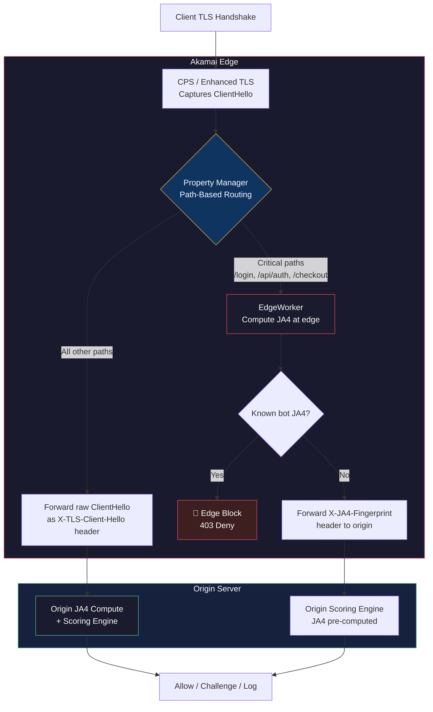

# JA4+ Bot Detection — Strategy Options & Implementation Guide

> **Author:** Nilanjan Siromani
> **Date:** 2026-07-06
> **Status:** Draft — Awaiting Review
> **Reference:** [browser_fingerprints_platforms.md](file:///Users/nilanjansiromani/codebase/ja3-fingerprint/browser_fingerprints_platforms.md) · [JA3_JA4_KNOWLEDGE_BASE.md](file:///Users/nilanjansiromani/codebase/ja3-fingerprint/JA3_JA4_KNOWLEDGE_BASE.md)

---

## 1. Strategy Overview

Six distinct approaches to deploying JA4+ TLS fingerprinting for bot detection, ranging from zero incremental Akamai cost to full managed service.

| Strategy | One-Line Summary |
|----------|-----------------|
| **A** — EdgeWorker at Edge | Compute JA4 in an Akamai EdgeWorker, inject header to origin |
| **B** — Property Manager + Origin Compute | Forward raw ClientHello to origin via PM header, compute JA4 at your server |
| **C** — DataStream + Offline Analysis | Ship ClientHello to SIEM/Arkime via DataStream, compute JA4 offline |
| **D** — Akamai Bot Manager | Use Akamai's managed bot detection (includes TLS fingerprinting internally) |
| **E** — Cloudflare Migration | Migrate to Cloudflare; use native JA4 signals in Bot Management |
| **F** — Hybrid (Selective EdgeWorker + Origin) | EdgeWorker on critical paths only, origin compute for everything else |

---

## 2. Strategy Comparison Matrix

| Dimension | A — EdgeWorker | B — Origin Compute | C — Offline | D — Bot Manager | E — Cloudflare | F — Hybrid |
|-----------|:-:|:-:|:-:|:-:|:-:|:-:|
| **Real-time blocking** | ✅ Yes | ✅ Yes | ❌ No | ✅ Yes | ✅ Yes | ✅ Yes |
| **JA4 available at edge** | ✅ Yes | ❌ No | ❌ No | ⚠️ Internal only | ✅ Yes | ⚠️ Partial |
| **JA4 available at origin** | ✅ Via header | ✅ Via header | ⚠️ Async | ❌ Bot verdict only | ✅ Via header | ✅ Via header |
| **Raw JA4 string accessible** | ✅ Yes | ✅ Yes | ✅ Yes | ❌ No | ✅ Yes | ✅ Yes |
| **Incremental Akamai cost** | 💰 Medium | 💚 Zero | 💰 Low–Medium | 💰💰💰 High | N/A (new vendor) | 💰 Low |
| **Origin compute load** | None | Medium | None | None | None | Low |
| **Implementation complexity** | Medium | Low–Medium | Low | Low (config) | High (migration) | Medium |
| **Latency impact** | +1–5ms (p50) | +0ms edge, +1–3ms origin | None | ~0ms | ~0ms | +1–5ms (critical paths) |
| **H2 fingerprint capture** | ✅ Possible | ✅ At origin | ⚠️ Requires PCAP | ✅ Internal | ✅ Native | ✅ Mixed |
| **QUIC/H3 support** | ✅ Via `AK_QUIC_VERSION` | ⚠️ Limited | ⚠️ Limited | ✅ Internal | ✅ Native | ⚠️ Partial |
| **Vendor lock-in** | Akamai | Akamai (light) | Akamai (light) | Akamai (heavy) | Cloudflare | Akamai |
| **Time to production** | 4–6 weeks | 2–4 weeks | 1–2 weeks | 2–4 weeks | 8–16 weeks | 4–6 weeks |

### Cost Comparison

| Strategy | Monthly Akamai Cost | Monthly Origin Cost | Annual Total Estimate |
|----------|-------------------|--------------------|-----------------------|
| **A** — EdgeWorker | $50–500 (per invocation) | ~$0 | $600–6,000 |
| **B** — Origin Compute | $0 | $20–100 (compute) | $240–1,200 |
| **C** — Offline | $50–200 (DataStream) | $20–50 (processing) | $840–3,000 |
| **D** — Bot Manager | $30,000–100,000+/yr | ~$0 | $30,000–100,000+ |
| **E** — Cloudflare | N/A | ~$0 | $50,000–200,000+ (Enterprise) |
| **F** — Hybrid | $10–100 (selective EW) | $10–50 (origin) | $240–1,800 |

---

## 3. Decision Flowchart



---

## 4. Detailed Implementation Strategies

---

### Strategy A — EdgeWorker at Edge

> **Best for:** Teams with EdgeWorker budget who want full JA4 visibility and edge-level blocking.

#### Architecture



#### Implementation Steps

**Step 1: CPS Configuration**
```xml
<!-- Enable in Enhanced TLS Deployment Settings -->
<save-client-hello>on</save-client-hello>
```

**Step 2: Property Manager Variables**
Create in Property Manager:
- `PMUSER_TLS_CLIENT_HELLO` — receives `%(AK_CLIENT_HELLO)`
- `PMUSER_QUIC_VERSION` — receives `%(AK_QUIC_VERSION)`
- `PMUSER_JA4_FINGERPRINT` — written by EdgeWorker

**Step 3: EdgeWorker Deployment**
```javascript
// main.js — JA4 EdgeWorker
import * as util from './util.js';
import { logger } from 'log';

export async function onClientRequest(request) {
  const client_hello = request.getVariable('PMUSER_TLS_CLIENT_HELLO');
  if (!client_hello) {
    logger.info("No ClientHello available");
    return;
  }

  const buffer = util.base64toUint8Array(client_hello);
  const quic_version = request.getVariable('PMUSER_QUIC_VERSION');
  const proto = quic_version ? "q" : "t";

  try {
    const ja4 = await util.getJA4Fingerprint(buffer, proto);
    request.setVariable('PMUSER_JA4_FINGERPRINT', ja4);
  } catch (error) {
    logger.error(`JA4 error: ${error.message}`);
  }
}
```

```bash
# Bundle and deploy
mkdir -p ja4-edgeworker && cd ja4-edgeworker
# Place main.js, util.js, bundle.json
tar -czf ja4-edgeworker.tgz main.js util.js bundle.json
# Upload via Akamai Control Center or akamai CLI
```

> [!TIP]
> Use [nmckay77/ja4-edgeworker](https://github.com/nmckay77/ja4-edgeworker) as the base for `util.js`. Fork it, audit the code, and pin to a specific commit.

**Step 4: Origin Header Injection**

In Property Manager, add an outgoing request header:
```
Header Name:  X-JA4-Fingerprint
Header Value: %(PMUSER_JA4_FINGERPRINT)
```

**Step 5: Edge-Level Rules (Optional)**

Property Manager match rules for known bot JA4s:
- Match: `PMUSER_JA4_FINGERPRINT` equals `t13d1712h1_ab0a1bf427ad_882d495ac381` (Python requests)
- Action: Deny with 403, or redirect to challenge page

#### Pros & Cons

| Pros | Cons |
|------|------|
| JA4 computed before request reaches origin | Per-invocation cost (~$0.15–0.50/M) |
| Can block at edge (saves origin bandwidth) | EdgeWorker cold-start latency (+1–5ms p50) |
| Full JA4 string available for PM rules | Requires EdgeWorker contract tier |
| Clean separation of concerns | EdgeWorker code maintenance burden |

#### Cost Breakdown

| Component | Unit Cost | Volume (est.) | Monthly |
|-----------|----------|---------------|---------|
| EdgeWorker invocations | ~$0.20/M | 10M requests | $2 |
| EdgeWorker invocations | ~$0.20/M | 100M requests | $20 |
| EdgeWorker invocations | ~$0.20/M | 1B requests | $200 |
| DataStream (if logging JA4) | ~$1/GB | 5 GB | $5 |

---

### Strategy B — Property Manager + Origin-Side Computation

> **Best for:** Cost-conscious teams who want real-time JA4 detection with zero incremental Akamai spend.

#### Architecture



#### Implementation Steps

**Step 1: CPS Configuration** (same as Strategy A)
```xml
<save-client-hello>on</save-client-hello>
```

**Step 2: Property Manager — Forward ClientHello to Origin**

Create PMUSER variable:
- `PMUSER_TLS_CLIENT_HELLO` — assigned from `%(AK_CLIENT_HELLO)`

Add outgoing request header to origin:
```
Header Name:  X-TLS-Client-Hello
Header Value: %(PMUSER_TLS_CLIENT_HELLO)
```

> [!WARNING]
> **Header size concern:** A base64-encoded ClientHello is typically 300–600 bytes but can reach ~1,500+ bytes with post-quantum key shares (X25519MLKEM768). Verify that your origin web server and any intermediate proxies accept headers of this size. Nginx default `large_client_header_buffers` is 8KB per header — this should be fine. Apache's `LimitRequestFieldSize` defaults to 8,190 bytes — also fine.

> [!IMPORTANT]
> **Critical dependency:** `%(AK_CLIENT_HELLO)` must be dereferenceable in Property Manager on your contract. If PM cannot access it directly, this strategy is **blocked**. Confirm with your Akamai TAM during Phase 0.

**Step 3: Origin-Side JA4 Computation**

Implement a JA4 parser at the origin. Below are examples in Python and Node.js.

**Python (Flask/Django middleware):**
```python
import hashlib
import base64
import struct

def compute_ja4(client_hello_b64: str, is_quic: bool = False) -> str:
    """
    Compute JA4 fingerprint from a base64-encoded ClientHello.
    Returns the full JA4 string: {prefix}_{cipher_hash}_{ext_hash}
    """
    raw = base64.b64decode(client_hello_b64)
    # Parse ClientHello structure
    # (Use a dedicated library like 'tlsfingerprint' or port the
    #  nmckay77/ja4-edgeworker util.js logic to Python)
    #
    # Key steps:
    #   1. Extract TLS version (from supported_versions extension, not record layer)
    #   2. Extract cipher suites, filter GREASE values
    #   3. Extract extensions, filter GREASE, exclude SNI(0x0000) and ALPN(0x0010)
    #   4. Extract ALPN value
    #   5. Extract signature algorithms
    #   6. Sort ciphers → SHA-256 → first 12 hex chars = ja4_b
    #   7. Sort extensions, append sigalgs with '_' separator → SHA-256 → first 12 hex = ja4_c
    #   8. Build prefix: {proto}{ver}{sni}{cipher_ct}{ext_ct}{alpn}
    #   9. Return: {prefix}_{ja4_b}_{ja4_c}

    # Placeholder — replace with real implementation
    # Recommended: port from https://github.com/nmckay77/ja4-edgeworker
    # or use: https://github.com/FoxIO-LLC/ja4 Python tools
    pass


# Flask middleware example
from flask import request, g

@app.before_request
def extract_ja4():
    client_hello = request.headers.get('X-TLS-Client-Hello')
    if client_hello:
        g.ja4 = compute_ja4(client_hello)
    else:
        g.ja4 = None
```

**Node.js (Express middleware):**
```javascript
const crypto = require('crypto');

function truncatedHash(data) {
  return crypto.createHash('sha256')
    .update(data)
    .digest('hex')
    .substring(0, 12);
}

// Express middleware
function ja4Middleware(req, res, next) {
  const clientHello = req.headers['x-tls-client-hello'];
  if (clientHello) {
    const buffer = Buffer.from(clientHello, 'base64');
    req.ja4 = computeJA4(buffer); // Port from nmckay77/ja4-edgeworker
  }
  next();
}
```

**Step 4: Scoring & Response at Origin**

```python
# Origin-side scoring engine
KNOWN_BROWSER_JA4 = {
    't13d1516h2_8daaf6152771_d8a2da3f94cd',  # Chrome 148/149
    't13d1717h2_5b57614c22b0_3cbfd9057e0d',  # Firefox 135-148
    't13d2013h2_a09f3c656075_7f0f34a4126d',  # Safari 18
}

KNOWN_BOT_JA4 = {
    't13d1712h1_ab0a1bf427ad_882d495ac381',  # Python requests
    't13d1712h1_ab0a1bf427ad_8e6e362c5eac',  # Python httpx
    't13d1411h2_cbb2034c60b8_e7c285222651',  # Go net/http
    't13d3112h2_e8f1e7e78f70_375ca2c5e164',  # curl default
    't13d410_16476d049b0b_78f1d400d464',      # OpenSSL s_client
}

def score_request(ja4, user_agent, h2_fingerprint, ip_reputation):
    score = 0

    # JA4 signal (0–30 points)
    if ja4 in KNOWN_BOT_JA4:
        score += 30
    elif ja4 not in KNOWN_BROWSER_JA4:
        score += 15  # Unknown fingerprint

    # ALPN signal (0–20 points)
    if ja4 and 'h1' in ja4.split('_')[0]:
        score += 20  # HTTP/1.1 only — strong bot signal

    # UA consistency (0–15 points)
    if ja4 in KNOWN_BROWSER_JA4 and 'bot' in user_agent.lower():
        score += 15  # Claims to be a bot but has browser TLS

    # ... add H2 mismatch, rate, IP reputation signals ...

    return score  # >60 → challenge, >80 → block
```

#### Pros & Cons

| Pros | Cons |
|------|------|
| **Zero incremental Akamai cost** | Cannot block at edge (origin must respond) |
| No EdgeWorker dependency | Adds origin compute load (~1–3ms per request) |
| Full control over JA4 logic at origin | Header size may be large with PQ TLS |
| Easier to update (deploy origin code, not EdgeWorker) | Bot traffic still reaches origin (bandwidth cost) |
| Can integrate with any origin-side framework | Requires `%(AK_CLIENT_HELLO)` in PM (contract-dependent) |

#### Cost Breakdown

| Component | Monthly Cost | Notes |
|-----------|-------------|-------|
| Akamai (PM config) | **$0** | Included with CDN |
| Origin compute | $20–100 | JA4 parsing adds ~1–3ms CPU per request |
| DataStream (optional) | $0–50 | Only if logging to external SIEM |
| **Total** | **$20–100/month** | |

---

### Strategy C — DataStream + Offline Analysis

> **Best for:** Building a baseline and understanding traffic before committing to real-time enforcement. Also ideal as a **Phase 0 / reconnaissance step** for any other strategy.

#### Architecture



#### Implementation Steps

**Step 1: CPS + PM Configuration** (same as Strategies A/B)

**Step 2: DataStream Configuration**

1. In Akamai Control Center → DataStream 2
2. Create or edit a stream
3. Add fields:
   - `PMUSER_TLS_CLIENT_HELLO` (custom variable)
   - `User-Agent`
   - `Client IP`
   - `Request URL`
   - `Response Status`
4. Set destination: S3 / Splunk / Sumo Logic / custom HTTPS endpoint
5. **Sampling:** Start at 1:100 to control costs, ramp to 1:10 after validation

**Step 3: Offline JA4 Computation Pipeline**

```python
#!/usr/bin/env python3
"""
Offline JA4 computation from DataStream logs.
Reads NDJSON from DataStream, computes JA4, outputs enriched records.
"""
import json
import sys
from ja4_parser import compute_ja4  # Your JA4 implementation

def process_datastream(input_file, output_file):
    with open(input_file) as fin, open(output_file, 'w') as fout:
        for line in fin:
            record = json.loads(line)
            client_hello = record.get('pmuser_tls_client_hello')
            if client_hello:
                ja4 = compute_ja4(client_hello)
                record['ja4'] = ja4
                record['ja4_prefix'] = ja4.split('_')[0] if ja4 else None
            fout.write(json.dumps(record) + '\n')

if __name__ == '__main__':
    process_datastream(sys.argv[1], sys.argv[2])
```

**Step 4: Analysis Queries**

```sql
-- Top 20 JA4 fingerprints hitting your site
SELECT ja4, COUNT(*) as hits, COUNT(DISTINCT client_ip) as unique_ips
FROM datastream_logs
WHERE ja4 IS NOT NULL
GROUP BY ja4
ORDER BY hits DESC
LIMIT 20;

-- JA4 vs User-Agent mismatches (bot signal)
SELECT ja4, user_agent, COUNT(*) as hits
FROM datastream_logs
WHERE ja4 IN (SELECT ja4 FROM known_browser_ja4s)
  AND user_agent LIKE '%bot%'
GROUP BY ja4, user_agent
ORDER BY hits DESC;

-- Unknown fingerprints (not in browser or known-bot lists)
SELECT ja4, COUNT(*) as hits
FROM datastream_logs
WHERE ja4 NOT IN (SELECT ja4 FROM known_browser_ja4s)
  AND ja4 NOT IN (SELECT ja4 FROM known_bot_ja4s)
GROUP BY ja4
ORDER BY hits DESC;
```

#### Pros & Cons

| Pros | Cons |
|------|------|
| Lowest risk — no production impact | **No real-time blocking** |
| Excellent for baselining and discovery | DataStream per-GB cost at high volume |
| No origin compute impact | Delayed detection (minutes to hours) |
| Works regardless of EdgeWorker contract | Cannot prevent bot damage in real-time |
| Perfect precursor to any other strategy | Sampling may miss low-volume bot patterns |

#### Cost Breakdown

| Component | Monthly Cost | Notes |
|-----------|-------------|-------|
| DataStream | $50–200 | ~$1/GB; volume depends on sampling rate |
| Offline compute (Lambda/EC2) | $10–50 | Batch processing |
| Storage (S3) | $5–20 | Log retention |
| **Total** | **$65–270/month** | |

---

### Strategy D — Akamai Bot Manager

> **Best for:** Enterprises with budget for a managed solution who prefer a vendor-managed detection engine over building their own.

#### Architecture



#### Implementation Steps

**Step 1: Procurement**
- Engage Akamai account team for Bot Manager pricing
- Typical: $30K–$100K+/year depending on traffic volume
- Negotiate: ensure TLS fingerprinting is included in the detection categories

**Step 2: Bot Manager Configuration**

1. Enable Bot Manager on your property in Akamai Control Center
2. Configure detection categories:
   - ✅ TLS Fingerprint
   - ✅ HTTP Fingerprint
   - ✅ Browser Validation (JavaScript challenge)
   - ✅ IP/ASN Reputation
   - ✅ Rate Detection
3. Set actions per bot category:

| Category | Action |
|----------|--------|
| Known good bots (Googlebot, Bingbot) | Allow (after verification) |
| Known bad bots | Deny / Tarpit |
| Unknown (suspicious TLS) | Challenge |
| Browser (normal TLS) | Allow |

**Step 3: Origin Header Integration**

Configure Bot Manager to forward headers:
```
Akamai-Bot-Score: 72
Akamai-Bot-Category: unknown
Akamai-Bot-Action: challenge
```

Your origin can use these for secondary decisioning or logging.

#### Pros & Cons

| Pros | Cons |
|------|------|
| Fully managed — Akamai maintains detection logic | **Expensive** ($30K–$100K+/year) |
| Multi-signal (TLS + JS + behavioral + IP) | No raw JA4 string — you get a verdict, not data |
| No engineering build/maintain burden | Vendor lock-in (hard to migrate detection logic) |
| Proven at scale (Akamai's global threat intel) | Less transparency into detection reasoning |
| Includes browser challenges and CAPTCHAs | May not catch custom uTLS bots if Akamai hasn't seen them |

#### Cost Breakdown

| Component | Annual Cost | Notes |
|-----------|-----------|-------|
| Bot Manager subscription | $30,000–$100,000+ | Negotiated per contract |
| Property Manager config | $0 | Included |
| Engineering (setup) | ~1 FTE-week | Configuration, not code |
| **Total** | **$30,000–$100,000+/year** | |

---

### Strategy E — Cloudflare Migration

> **Best for:** Teams already considering CDN migration, or those who want native, first-party JA4 support without EdgeWorker overhead.

#### Architecture



#### Implementation Overview

**Cloudflare exposes JA4 natively** in WAF rules and Workers:

```javascript
// Cloudflare Worker — access JA4 directly
export default {
  async fetch(request) {
    const ja4 = request.cf?.ja4 || 'unknown';
    const botScore = request.cf?.botManagement?.score || 0;

    // Add headers for origin
    const newRequest = new Request(request);
    newRequest.headers.set('X-JA4-Fingerprint', ja4);
    newRequest.headers.set('X-Bot-Score', botScore.toString());

    return fetch(newRequest);
  }
}
```

**WAF Rule Example:**
```
(cf.bot_management.ja4 eq "t13d1712h1_ab0a1bf427ad_882d495ac381") → Block
```

#### Pros & Cons

| Pros | Cons |
|------|------|
| Native JA4 — no computation needed | **Requires CDN migration** (massive effort) |
| JA4 available in WAF rules natively | Enterprise-only ($50K–$200K+/year) |
| Workers are cheaper than EdgeWorkers | Risk of migration downtime |
| Better JA4/H3 support (Cloudflare is a JA4 early adopter) | Loss of existing Akamai-specific configs |
| Transparent bot scoring with raw signals | New vendor relationship |

#### Cost Breakdown

| Component | Annual Cost | Notes |
|-----------|-----------|-------|
| Cloudflare Enterprise | $50,000–$200,000+ | Negotiated; includes Bot Management |
| Migration engineering | 4–8 FTE-weeks | DNS, config, testing |
| **Total** | **$50,000–$200,000+/year** | Plus significant migration effort |

---

### Strategy F — Hybrid (Selective EdgeWorker + Origin Compute)

> **Best for:** Teams who want edge-level blocking on critical paths but can't justify EdgeWorker cost for all traffic. **This is the recommended strategy for most use cases.**

#### Architecture



#### Implementation Steps

**Step 1: CPS + PM Variables** (same as Strategies A/B)

**Step 2: Property Manager — Path-Based Routing**

Create two rule sets in Property Manager:

**Rule 1: Critical paths → EdgeWorker**
- Match: Path matches `/login*` OR `/api/auth*` OR `/checkout*` OR `/payment*`
- Behavior: Invoke EdgeWorker (JA4 computation)
- Behavior: Set `X-JA4-Fingerprint: %(PMUSER_JA4_FINGERPRINT)` on origin request
- Behavior: If `PMUSER_JA4_FINGERPRINT` matches known bot → Deny 403

**Rule 2: All other paths → Origin compute**
- Match: All other requests
- Behavior: Set `X-TLS-Client-Hello: %(PMUSER_TLS_CLIENT_HELLO)` on origin request
- No EdgeWorker invocation

**Step 3: Origin handles both cases**

```python
# Origin middleware — handles both Strategy A and B headers
from flask import request, g

@app.before_request
def extract_ja4():
    # Case 1: EdgeWorker already computed JA4
    ja4 = request.headers.get('X-JA4-Fingerprint')

    if not ja4:
        # Case 2: Raw ClientHello forwarded, compute locally
        client_hello = request.headers.get('X-TLS-Client-Hello')
        if client_hello:
            ja4 = compute_ja4(client_hello)

    g.ja4 = ja4
    g.ja4_source = 'edge' if request.headers.get('X-JA4-Fingerprint') else 'origin'
```

**Step 4: Tunable Path Configuration**

Keep the critical-path list in a configuration file that can be updated without redeploying:

```json
{
  "edgeworker_paths": [
    "/login",
    "/api/auth/*",
    "/checkout/*",
    "/payment/*",
    "/api/v*/register"
  ],
  "origin_compute_paths": ["*"],
  "edge_block_ja4s": [
    "t13d1712h1_ab0a1bf427ad_882d495ac381",
    "t13d1411h2_cbb2034c60b8_e7c285222651",
    "t13d410_16476d049b0b_78f1d400d464"
  ]
}
```

#### Pros & Cons

| Pros | Cons |
|------|------|
| Edge blocking on high-value paths | More complex PM configuration |
| Low EdgeWorker cost (only critical paths) | Two code paths to maintain (edge + origin) |
| Full JA4 coverage via origin fallback | Bots on non-critical paths still reach origin |
| Flexible — adjust EdgeWorker paths as needed | Requires both EdgeWorker and origin JA4 logic |
| Best cost/protection ratio | Slightly more testing surface |

#### Cost Breakdown

| Component | Monthly Cost | Notes |
|-----------|-------------|-------|
| EdgeWorker (critical paths only) | $5–50 | ~5–10% of total traffic |
| Origin compute (remaining traffic) | $15–75 | JA4 parsing at origin |
| DataStream (optional) | $0–50 | Sampled logging |
| **Total** | **$20–175/month** | |

---

## 5. Strategy Selection Guide

### By Use-Case Profile

| Profile | Recommended Strategy | Rationale |
|---------|---------------------|-----------|
| **"We want to understand our traffic first"** | **C** (Offline) → then B or F | Start with zero-risk baselining |
| **"We need real-time blocking, minimal cost"** | **B** (Origin Compute) | Zero Akamai cost, full JA4 access |
| **"We need edge blocking on login/checkout"** | **F** (Hybrid) | Best cost/protection ratio |
| **"We have EdgeWorker budget for everything"** | **A** (EdgeWorker) | Cleanest architecture |
| **"We want a managed solution, have budget"** | **D** (Bot Manager) | Zero engineering maintenance |
| **"We're considering leaving Akamai anyway"** | **E** (Cloudflare) | Native JA4, modern stack |

### Recommended Progression

For most teams, the optimal path is a **staged progression**:

```
Phase 0:  Strategy C (Offline) — 2 weeks
            ↓ baseline established
Phase 1:  Strategy B (Origin Compute) — 4 weeks
            ↓ real-time scoring validated
Phase 2:  Strategy F (Hybrid) — upgrade critical paths to edge blocking
            ↓ ROI proven
Phase 3:  Strategy A or D — full edge coverage if budget allows
```

---

## 6. Final Decision Matrix

| Decision Factor | Your Answer | Points To |
|----------------|-------------|-----------|
| EdgeWorker budget available? | Yes → A or F | No → B or C |
| Need real-time blocking? | Yes → A, B, D, E, or F | No → C |
| Bot Manager budget ($30K+/yr)? | Yes → D | No → A, B, C, or F |
| Considering CDN migration? | Yes → E | No → A, B, C, D, or F |
| Want raw JA4 strings? | Yes → A, B, C, or F | No → D |
| Critical paths need edge-level protection? | Yes → A or F | No → B |
| Engineering capacity for origin-side code? | Yes → B or F | No → A or D |

> [!IMPORTANT]
> **Regardless of which strategy you choose**, start with Strategy C (Offline Analysis) for 1–2 weeks to build your JA4 baseline. This is a prerequisite for tuning any real-time strategy and costs <$100.
